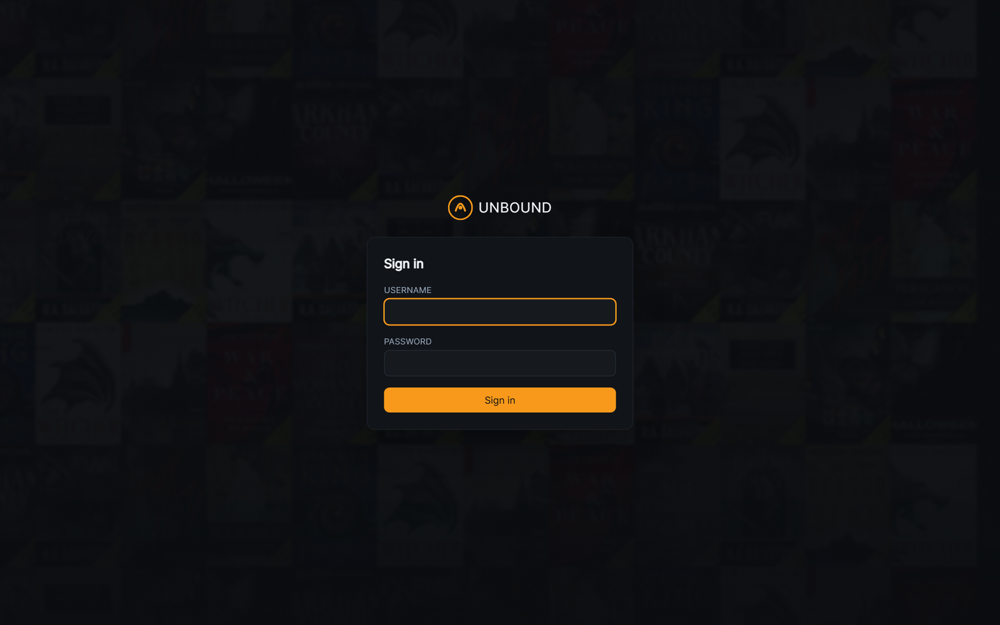
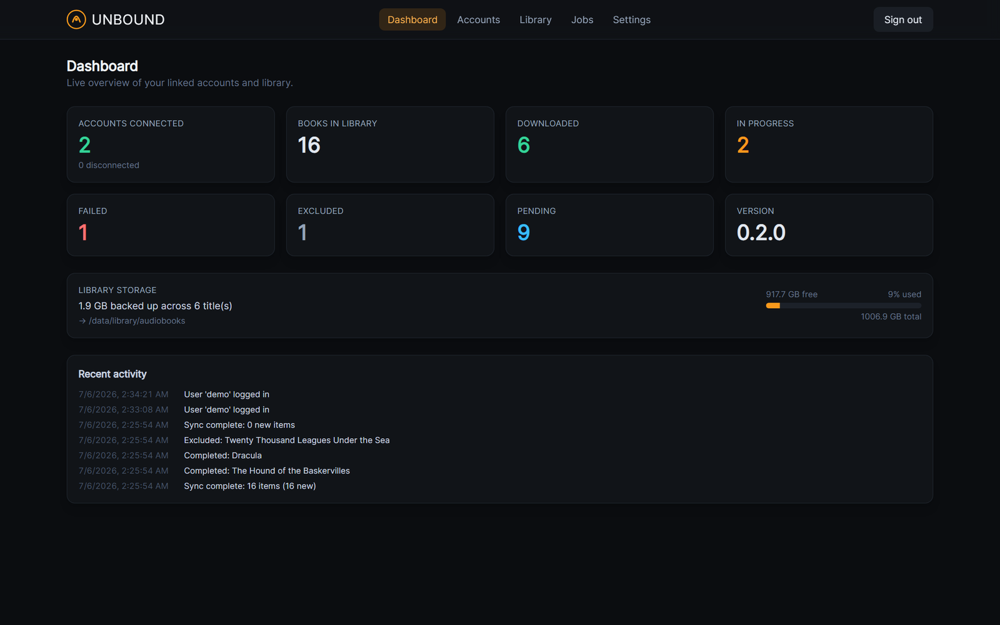
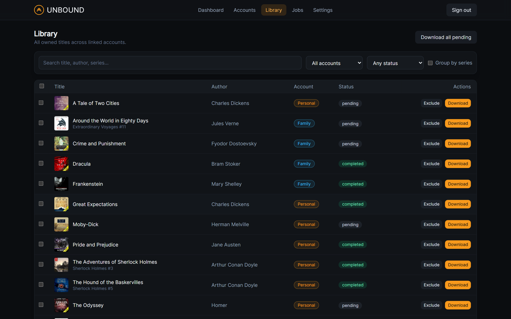
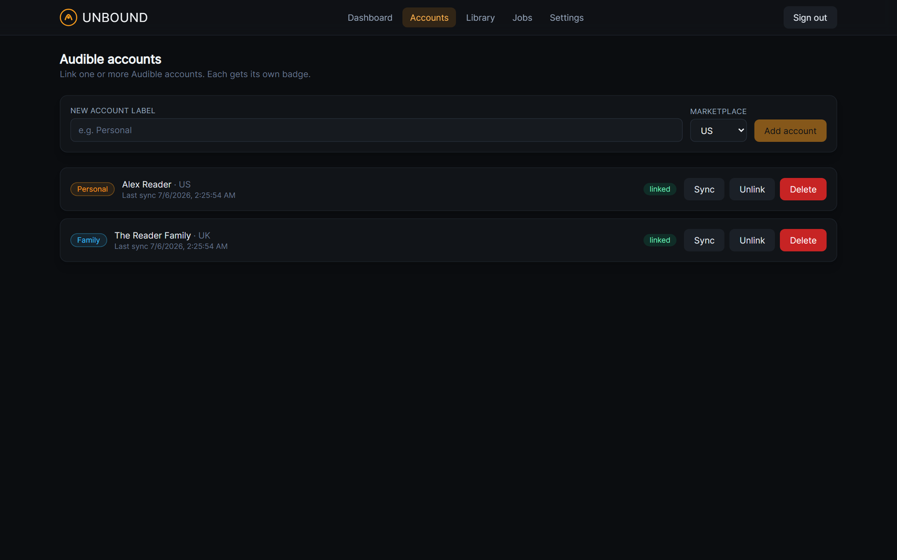
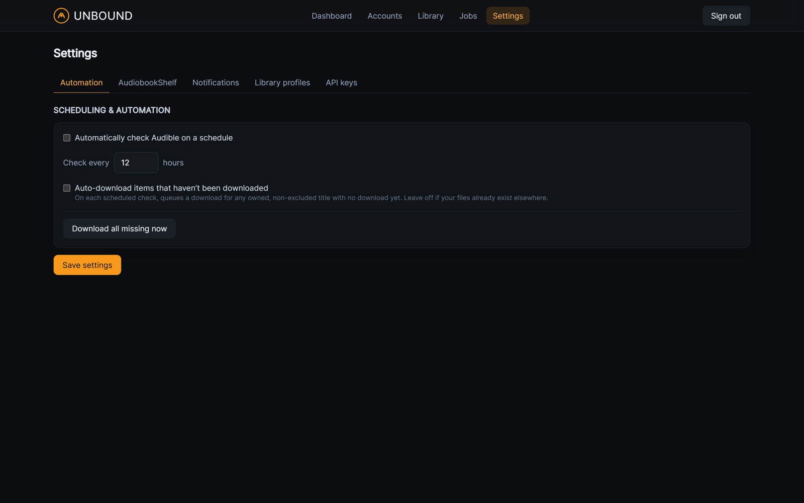

# Unbound

**Self-hosted, UI-first Audible library manager** — connect your Audible account(s), back up and
decrypt the audiobooks you own, and organize them into a clean library, all from a secured dark web
UI. A modern, container-native take on [Libation](https://github.com/rmcrackan/Libation).

<p align="center">
  
</p>

> [!IMPORTANT]
> **Personal-use backup only.** Unbound requires *your own* Audible credentials and is intended for
> backing up content you have already purchased, for personal use. Removing DRM may be restricted in
> your jurisdiction and generally violates Audible's Terms of Service. Do not use Unbound to
> redistribute or share audiobooks. You accept these terms during first-run setup.

## Features

- **Secured** — first-run admin setup, login page, Argon2 password hashing, HttpOnly/Secure
  session cookies, auto-logout after 2h of inactivity, login rate-limiting, CSP + security headers.
- **Two-factor authentication (TOTP)** — authenticator-app codes + one-time recovery codes.
- **Single sign-on (OIDC)** — sign in through Authentik, Keycloak, Authelia, Google, or any
  OpenID Connect provider (authorization code + PKCE).
- **Multiple Audible accounts** — link several at once; each gets its own colored badge.
- **Two linking flows** — guided in-app (email + password, with OTP/CAPTCHA prompts) *or*
  external-browser (log in on Amazon, paste the response URL).
- **Library sync** — pull your full library; search, filter by status, group by series, paginate.
- **Download → decrypt → tag → move** — AAXC (per-file voucher) and AAX (activation bytes) via
  ffmpeg, **embedded chapters**, cover art + metadata, Libation-style naming templates, with
  **resume + retry**.
- **Exclude toggle** and **bulk actions** (download/exclude selected).
- **Scheduling & automation** — periodic library checks and optional auto-download of new titles.
- **Notifications** — [Apprise](https://github.com/caronc/apprise) (ntfy, Discord, Telegram,
  email, webhooks…) on new books / completed / failed.
- **AudiobookShelf integration** — books link straight to the matching ABS item, and titles
  already in ABS can be badged and auto-skipped from downloads (admin re-include sticks).
- **Dashboard + REST `/api/stats`** — connected/failed/in-progress counts, storage health,
  live activity feed (SSE), and a read-only API key for a [Homepage](https://gethomepage.dev) widget.
- **Installable PWA** with a dark, Audible-inspired theme — usable on phone/tablet.
- **Secrets encrypted at rest** (AES-256-GCM); raw passwords are never stored; logs are redacted.

## Screenshots

| Dashboard | Library |
| --- | --- |
|  |  |

| Accounts | Settings |
| --- | --- |
|  |  |

## Quick start (Docker Compose)

Unbound ships as a single image (published to GHCR on each release) — the API also serves
the web UI. Create a `docker-compose.yml`:

```yaml
services:
  unbound:
    image: ghcr.io/hankscafe/unbound:latest
    restart: unless-stopped
    environment:
      # Generate: python -c "import secrets; print(secrets.token_urlsafe(48))"
      UNBOUND_SECRET_KEY: "CHANGE-ME"
      UNBOUND_DATA_DIR: /data
      UNBOUND_DATABASE_URL: sqlite:////data/unbound.db
      # Set false only for plain-HTTP LAN testing; keep true behind HTTPS.
      UNBOUND_COOKIE_SECURE: "true"
    volumes:
      - unbound_data:/data
      # Your audiobook library lives here — bind-mount a host/NAS directory:
      - /path/to/your/audiobooks:/data/library
    ports:
      - "8080:8000"

volumes:
  unbound_data:
```

> Upgrading from ≤ 0.6.x (two images)? Replace the `backend`/`frontend` services with the
> single `unbound` service above — same volumes, so your data and library carry over.

Then:

```bash
docker compose up -d
```

Open **http://localhost:8080**, complete the first-run admin setup, then add and link an Audible
account. Point your library profile's root at a path under `/data/library` (e.g.
`/data/library/audiobooks`) so decrypted files land in your mounted directory.

> Behind anything beyond localhost, run Unbound behind a TLS reverse proxy (Caddy/Traefik/nginx)
> and keep `UNBOUND_COOKIE_SECURE=true`.

## Building from source

```bash
git clone https://github.com/hankscafe/unbound.git
cd unbound
docker compose -f deploy/docker-compose.yml up -d --build   # uses deploy/.env
```

Local dev (backend needs `ffmpeg` on PATH):

```bash
# Backend (Python 3.11–3.12)
cd backend && python -m venv .venv && . .venv/Scripts/activate   # or bin/activate
pip install -e ".[dev]"
export UNBOUND_SECRET_KEY=dev UNBOUND_COOKIE_SECURE=false
uvicorn app.main:app --reload --port 8000

# Frontend (Node 20+)
cd frontend && npm install && npm run dev   # http://localhost:5173, proxies /api to :8000
```

## Homepage widget

Create a read-only API key under **Settings → API keys**, then in Homepage's `services.yaml`:

```yaml
- Media:
    - Unbound:
        icon: mdi-book-music
        href: http://your-host:8080
        widget:
          type: customapi
          url: http://your-host:8080/api/stats
          headers:
            X-API-Key: unb_your_key_here
          mappings:
            - { field: accounts_linked, label: Linked }
            - { field: downloaded, label: Downloaded }
            - { field: in_progress, label: Active }
            - { field: failed, label: Failed }
```

## How it works

| Layer     | Tech |
|-----------|------|
| Backend   | Python · **FastAPI** · SQLModel · Alembic migrations · in-process worker |
| Audible   | [`audible`](https://github.com/mkb79/Audible) (auth, device registration, licensing) |
| Decrypt   | `ffmpeg` — `-audible_key/-audible_iv` (AAXC) or `-activation_bytes` (AAX) |
| Frontend  | React · Vite · TypeScript · Tailwind (dark Audible theme) · TanStack Query · PWA |
| Database  | SQLite by default; Postgres via `UNBOUND_DATABASE_URL` |
| Deploy    | Docker Compose, single image (FastAPI serves the SPA); library is a host bind mount |

See [`docs/`](docs/) for the [configuration reference](docs/configuration.md) and
[security model](docs/security.md).

## Development

```bash
cd backend && pip install -e ".[dev]" && ruff check app && pytest -q   # lint + tests
cd frontend && npm ci && npm run typecheck && npm run build            # typecheck + build
```

CI (GitHub Actions) runs these on every push/PR. Tagging `vX.Y.Z` publishes container images to
GHCR and creates a GitHub Release.

## License

AGPL-3.0-or-later. Unbound distributes *software* only — never audiobook content. Built on
[`audible`](https://github.com/mkb79/Audible) (AGPL-3.0); review its license for the
network-copyleft implications of hosting a modified version.
